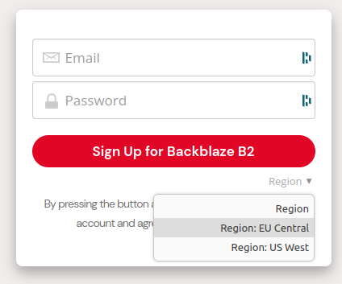
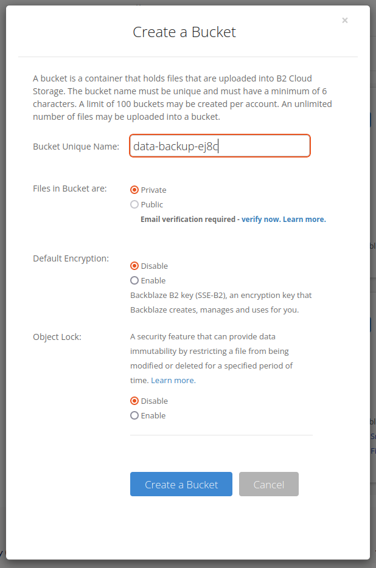
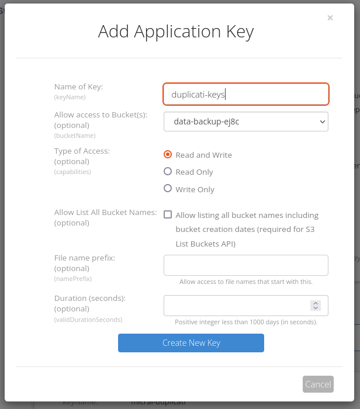
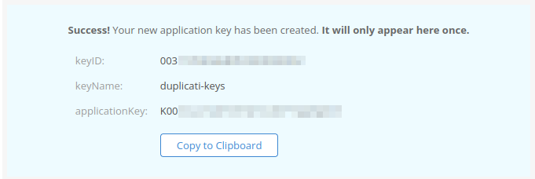
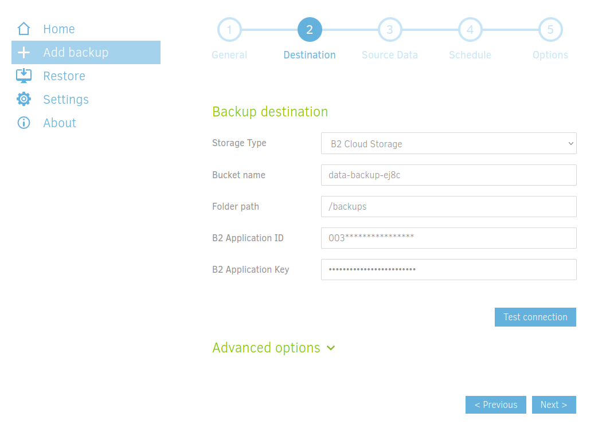
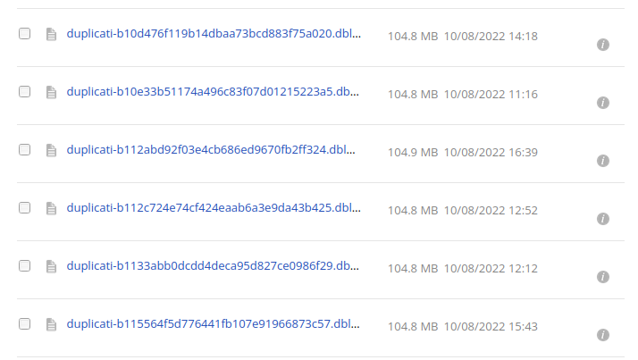

Did you know that [World Backup Day](https://www.worldbackupday.com/) is on the 31rst of March? Heck, did you even know there was a **World Backup Day**? Indeed backing up your data is important, but what to do?  Starting by having a remote copy of your most important data on services like Google Drive, Dropbox, Onedrive, etc... is a good start! But what if you want to do it **yourself**? Maybe because you want **better control over your data**, or maybe because you do not want [Google to shut down your account because of what you have on your Google Drive](https://www.nytimes.com/2022/08/21/technology/google-surveillance-toddler-photo.html)? Or maybe you just want to do it yourself because you can. In any case, the  general rule of thumb for backing up data is to follow the **3-2-1** rule:
- **3** copies of your important data
- on **2** different storage mediums
- **1** of which is off-site

The first two points are quite easy to satisfy. However, the last one (**having a backup off-site**), is a bit more tricky. You either need to be able to access a bit of storage on a friend's NAS or set up a second NAS in your family or friend's house. Certainly doable, but not the easiest solution since you need to maintain two separate computers, one of which is not easily accessible because it is precisely off-site.

Another way to back up your data off-site is to use a **cloud storage provider** and backup software. I chose to use [BackBlaze](https://www.backblaze.com/) as the cloud provider because it is **cheap and easy to use**, even if you never used such services before. For the backup software, I will use [Duplicati](https://www.duplicati.com/). Duplicati is open source and allows for **encrypted and compressed incremental backups**. Incremental backup is an incredibly useful feature: You only backup the files that changed since the last backup. You do not need to back up all your files every time! Ah, and yes, Duplicati is compatible with BackBlaze!

# Preparing the cloud ☁️

### Creating my first bucket 🪣

Let's tackle the cloud part. Data are stored in a **bucket**, which is roughly a top-level folder that will contain all my backup data. To create my bucket I first sing up for an account on BackBlaze. I chose the **EU region** when creating my account because first, I am living in Europe, and then to prevent my data from being stored in the US. I then created a bucket to store my backup data in the "buckets" section of the "My Account" page. Beware that it seems like **the name should be original among all bucket names on BackBlaze**. To make sure the name was not already taken, I added **4 random characters** at the end of it. I set the bucket to private. It is possible to **enable encryption**, however, it is not necessary since my backup will already be encrypted by Duplicati before being uploaded to BackBlaze.




<!-- <div class="row justify-content-sm-center">
    <div class="col-sm-5 mt-4 mt-md-0">
    
    </div>
     <div class="col-sm-4 mt-4 mt-md-0">
    
    </div>
</div> -->

### Keys of the realm 🔑
To programmatically access your bucket, Duplicati needs **API keys** - here called Application Keys. If you have never heard of it, you can see them as **passwords for applications**. I generated keys just for Duplicati in the "App Keys" section. I gave them a friendly name so I will know what they are used for in the future. Then I chose for which bucket they will be valid. It is possible to select all the buckets, but that is always a good practice to **give API keys only the rights they need**, nothing more! Then I chose `Read and Write` rights because I want to upload my backups (write), but I also want to retrieve them if needed (read). I left all the other parameters blank.

Once the keys are created they appear in a light blue rectangle (see picture below). I left the **webpage open** until I copied them in Duplicati. If you follow the same process as I do, beware: **the keys only appear once**!





<!-- <div class="row justify-content-sm-center">
    <div class="col-sm-4 mt-4 mt-md-0">
    
    </div>
    <div class="col-sm-5 mt-4 mt-md-0">
    
    </div>
</div> -->

# Duplicati in a container 🐳

### Getting the container ready 🧰

Once the cloud part is done, I focused on Duplicati itself. For all the services I run at home, I use **Docker**. You can get Docker installation instructions [here](https://docs.docker.com/engine/install/ubuntu/). To keep things simple and readable, I like to use **Docker Compose**. It can be easily installed with a simple command:

```bash
sudo apt install docker-compose-plugin
```
This command will install docker compose V2 (more info [here](https://www.docker.com/blog/announcing-compose-v2-general-availability/)). Not the V1 pip package `docker-compose` (there is a hyphen between *docker* and *compose* in this case).

Docker compose is a nice tool that allows **configuring easily docker containers with a text file**, which is always called `docker-compose.yaml`. It also provides some useful tools to **recreate** containers and **pull** new images for example.

I started by creating a new folder called `duplicati`, and inside this folder, I created a file called, you guessed it, `docker-compose.yaml`. Examples of `docker-compose` files are often provided on **Docker Hub**. It is the case for  [Duplicati](https://hub.docker.com/r/linuxserver/duplicati).  Here is the file content:


```Dockerfile
---
version: "2.1"
services:
  duplicati:
    image: lscr.io/linuxserver/duplicati:latest
    container_name: duplicati
    environment:
      - PUID=0
      - PGID=0
      - TZ=Europe/Paris
    volumes:
      - ./duplicati-config:/config
      - ./local-backups:/backups
      - <path-to-data>:/source
    ports:
      - 8200:8200
    restart: unless-stopped
```
As you can see, I used the [linuxserver.io](https://www.linuxserver.io/) image.

- `PUID` and `PGID` are ids for the user that will run Duplicati **inside the container**. Generally speaking, you want to set both of them to `1000`, which is the id of the **first created user**. However, I set them to `0`, because I want to access files owned by **root**.
- `TZ` is simply the timezone, to make sure scheduled backups run when you expect them to!
For the volumes, the config will be stored in `duplicati-config` and local backups in `local-backups`. However since I will use BackBlaze, there should not be any backups stored there. Both folders will be inside the `duplicati` folder since I used relative paths.
- The path for the `/source` folder should be updated according to your needs. I map it to an external SSD where are located the files I want to backup. It might be tempting to add the flag `ro` for `read-only`, to make sure Duplicati **does not alter the source files** This will, however, **prevent** Duplicati from **restoring** the files in the **source destination**, and you will have to restore them in another folder (such as `./local-backups`). 
- I left the port to the default value of `8200` in this example, but you can use whatever value suits your needs.

Once this file was created I started the container with :
```bash
docker compose up -d
```
The `-d` option makes sure the container is started in a **detached mode**. I made sure everything was ok by running `docker compose logs -f`. 

### Configuration through the web interface 🔧

To reach the web interface, I went to the IP of the computer hosting the docker container, followed by the port, so in the case of this example : `8200`.

The web interface is straightforward. I created a new backup. In destination, I choose specifically the `B2 Cloud Storage` option. The **bucket name** is the same as the one I just created : `data-backup-ej8c`. **Folder path** is the path inside the bucket. I simply add a directory called `backcups` at the root of the bucket. and finally I inputed the `keyID` (for `B2 Application ID`) and `applicationKey` (for `B2 Application Key`) that were generated on the Backblaze website.



<!-- <div class="row justify-content-sm-center">
    <div class="col-sm-8 mt-4 mt-md-0">
    
    </div>
</div> -->

I then followed through with the configuration, by selecting my source file and also specifying the backup schedule.

Once the backup is done, I clicked _Run Now_ to make sure the **first backup** was created and voilà!

Browsing the files on Backblaze should now show **a bunch of files** all of the same sizes (except for a few with index in the name).



<!-- <div class="row justify-content-sm-center">
    <div class="col-sm-8 mt-4 mt-md-0">
    
    </div>
</div> -->

### Updating Duplicati ⬆️

Since I used Docker Compose, updating Duplicati is **really simple**. Once in the same folder as the `docker-compose.yaml` file, I first update the image with :
```bash
docker compose pull
```
and recreate the container with:
```bash
docker compose up -d
```

# Reliable backups ☝️
Backblaze can arguably be regarded as **reliable**. It is to say that I will not lose files hosted there. But what if I **lost the Duplicati container**? Recreating the container can be achieved in a **matter of minutes** from a fresh `docker-compose.yaml` file. However, I will miss the backup configuration. Fortunately, it is possible to **export** a Duplicati **backup configuration file**. I exported the configuration file **with the passwords** (it is to say with the Backblaze API keys) and safely backed it up on another computer.

⚠️ Bear in mind that if you **encrypted** your backup, the **recovery key will not be exported** in the configuration file and you will have to back it up yourself somewhere. Maybe on your password manager?

