Recently I wanted to play _Pokémon Fire Red_ 🔥 on original hardware, it is to say a **Game Boy Advance** (GBA) and not an emulator of any kind. Since I had a GBA SP (AGS-001) as a kid, I wanted to play on a **standard** GBA for the sake of "novelty". However, the original GBA has a **reflective screen**. This type of screen does not emit its **own light** and needs an external light source (such as the sun for example). This makes the screen notoriously **difficult to see** since you need to orient it in a **certain angle** in order to see what it is displaying. More modern screen technologies include their own source of light. The first generation of GameBoy Advance SP (AGS-001) model features a **frontlit screen**. This is the same principle as the old reflective screen, except that light is emitted by a small **led strip** at the bottom of the screen. The latest GBA SP model (AGS-101) features a modern **backlit screen**, where the light source comes from **behind the pixels**. However, this GBA SP revision is rarer that the common AGS-001 frontlit model. In order to play in the best conditions but yet with original hardware, I will mod an original GBA to make a more **up-to-date handheld console**.

<!--   -->

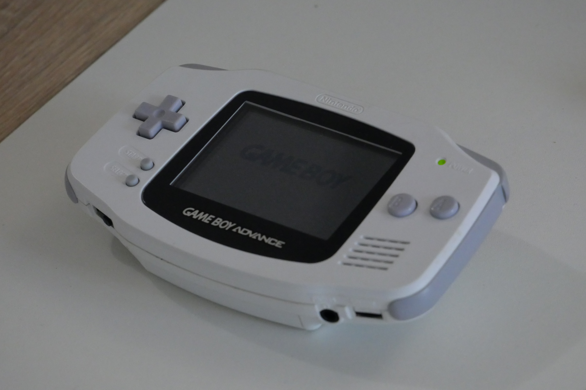
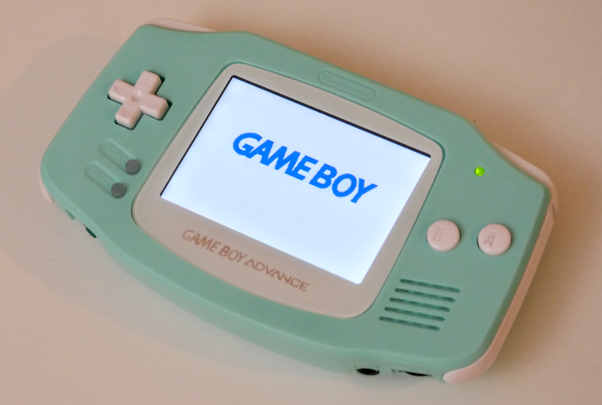

<!-- 

    

    
    

    

    
    

 -->

## Modding a GBA

As I told you, the main improvement point for the GBA is to **replace the screen** for a modern backlit LCD. However this is **not the only thing** you might want to change. Here is a list of all the parts I bought for my modding project. I ordered all my parts on [Retro Moding](https://www.retromodding.com/), although you can buy them on **various specialized websites** as well Aliexpress.

### Parts
- [IPS LCD Screen](https://www.retromodding.com/collections/game-boy-advance/products/game-boy-advance-ips-lcd): There are various **LCD mods** for the GBA, such as retrofitting a AGS-101 (second GBA SP version) screen, or a **DSi lower screen** (this mod is often called _ITA_ : DS<em>i</em> <em>t</em>o GB<em>A</em> ). However I went with the more modern FunnyPlaying IPS LCD V2, which supports **brightness control** provided that you solder a few wires (more on that later).
  
- [New shell](https://www.retromodding.com/collections/game-boy-advance/products/funny-playing-game-boy-advance-shells-branded): I decided to buy a new shell for 3 reasons. First, because I bought a second-hand Game Boy Advance and although the shell was in pretty good condition, I vanted to have a _brand new shell_ feeling. Then because the LCD screen I bought necessitates some **cuts** in the original shell, and I wanted to **preserve it**. Fortunately FunnyPlaying also provides shell **specifically moulded** for their LCD. And finally, because there are a lot of color to choose from. So you can build yourself a **nice-looking GBA!**
  
- [New Buttons](https://www.retromodding.com/products/game-boy-advance-buttons?variant=5398357278753): Just to match your new shell!

- [New Silicone Pads](https://www.retromodding.com/products/funny-playing-game-boy-advance-silicone-pads?variant=41350446645404): The original silicone pads might be a bit **worn out** so you might want to replace them. Moreover, if you want to use a **clear case**, you can choose **colorful** silicon pads. Bear in mind that your start and select buttons will the **same color** as the silicone pads (since they actually are a one-piece silicone pad)!
  
- [New Glass Lens](https://www.retromodding.com/products/budget-game-boy-advance-glass-screen-lens?variant=31432753184832): The FunnyPlaying IPS LCD V2 has slightly **different dimensions** from the old screen, so you need an **appropriate lens**. A glass lens will be more **scratch-resistant** than a plastic one, but it might **shatter** if dropped. Pick the one you like! There are several colors and variants as well.
  
- [USB-C Rechargeable Battery](https://www.retromodding.com/products/game-boy-advance-rechargeable-usb-c-battery-pack?_pos=1&_sid=7e53d2891&_ss=r): The original Game Boy Advance used two AA batteries. Fortunately, you can now use a USB-C **rechargeable battery pack** that fits in the battery compartment. This battery pack fits in the FunnyPlaying shell without modification. If you use an original shell, you will need to **trim** a bit the battery compartment.

### Building Process

#### Disassembly

First I started by fully dissasembling the original GBA. For this step you need **two** screw drivers. A standard **philips** screw driver and a **tri-wing** one (this type of screw is very oftenly used by Nintendo). This is an appropriate time to **clean the PCB** with **isopropyl alcohol**, especially the golden pads located **under the buttons** to make sure the silicon pads make **good contact** with them.

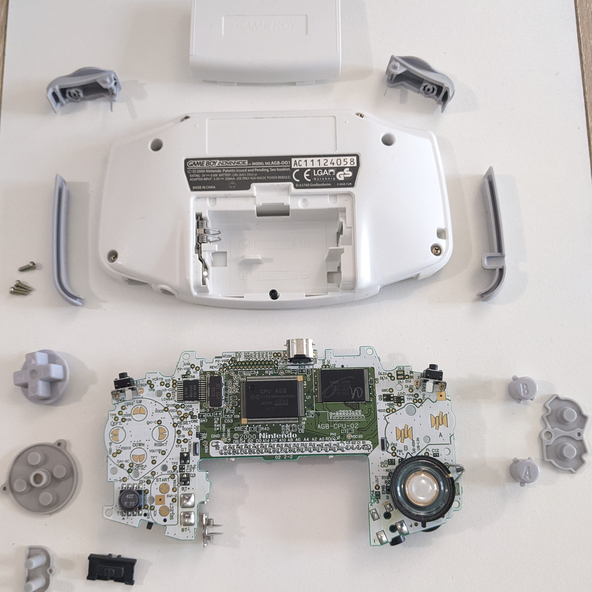
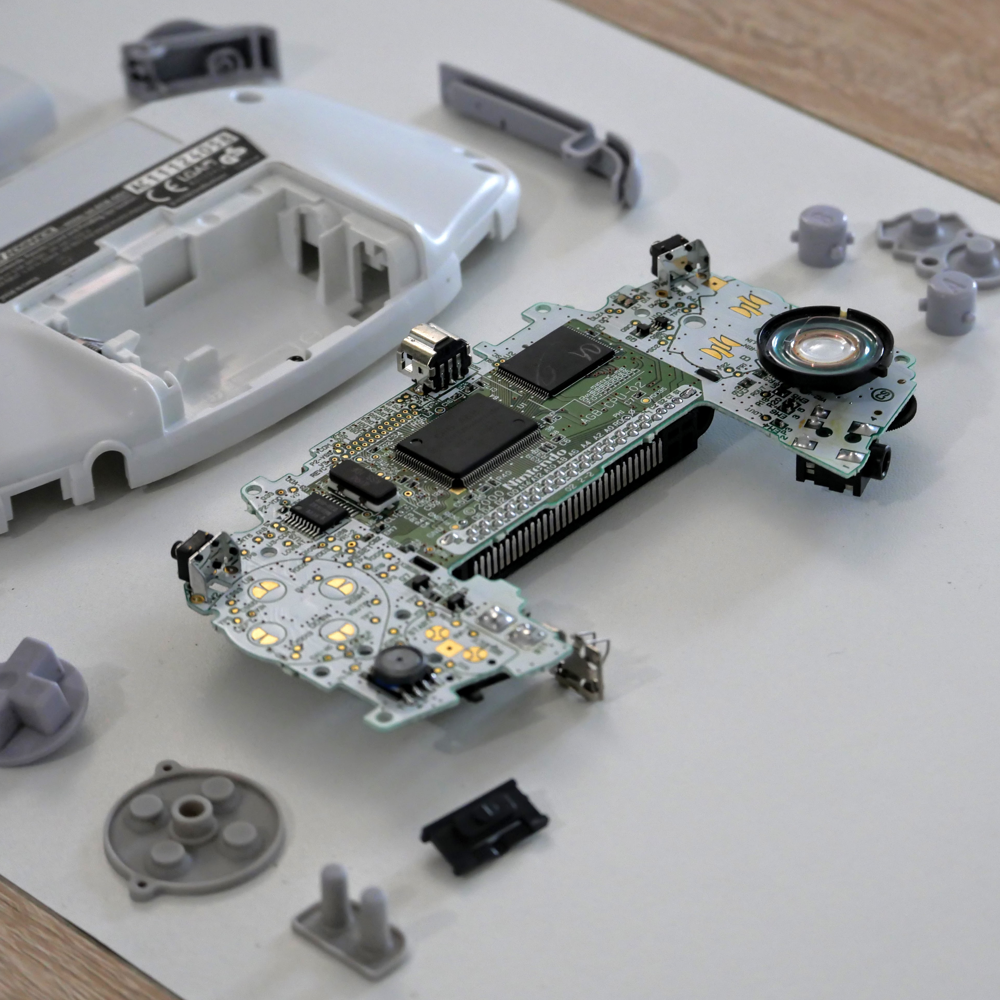

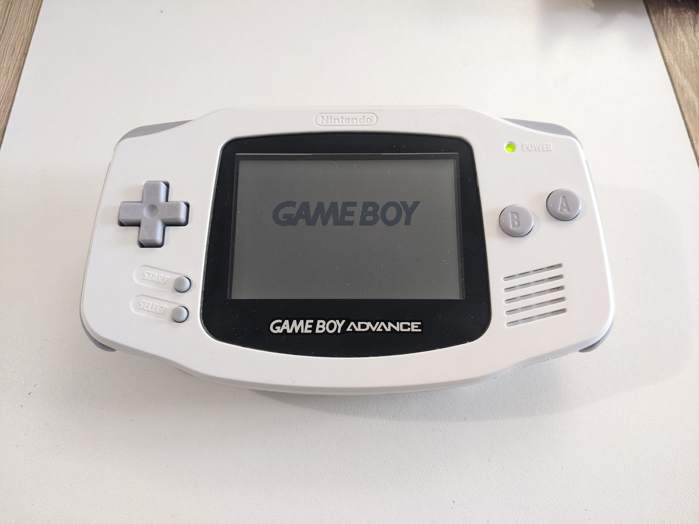
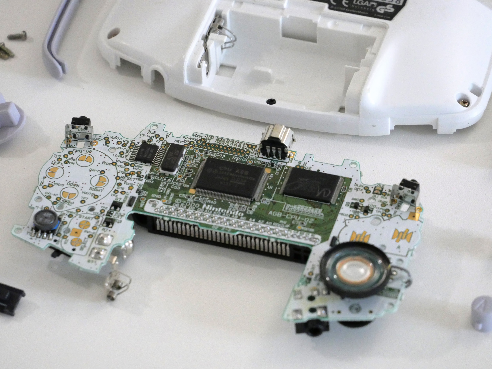

<!-- 
 

    

    
    

    

    
    

    

    
    

    

    
    

 -->

Although I did not take any pictures of this step, I advise you to **test the screen** at this step. Simply put the **ribon cable** of the new screen in the connector located at the top of the motherboard, and power up your GBA, just to confirm the screen is turning on and showing the _Game Boy_ logo.

#### Assembly

Once I confirmed the screen was ok, I soldered the three **tiny wires** that came with the screen. These wires are to be soldered on the motherboard to enable screen brightness control through `select+L` or `select+R`. I found easier to solder the wires to the ribon cable first and then to solder the other ends to the appropriate locations. I used a bit of **duct tape** (since I did not had any kapton tape) to secure the ribon cable in place on the **back of the screen**. 

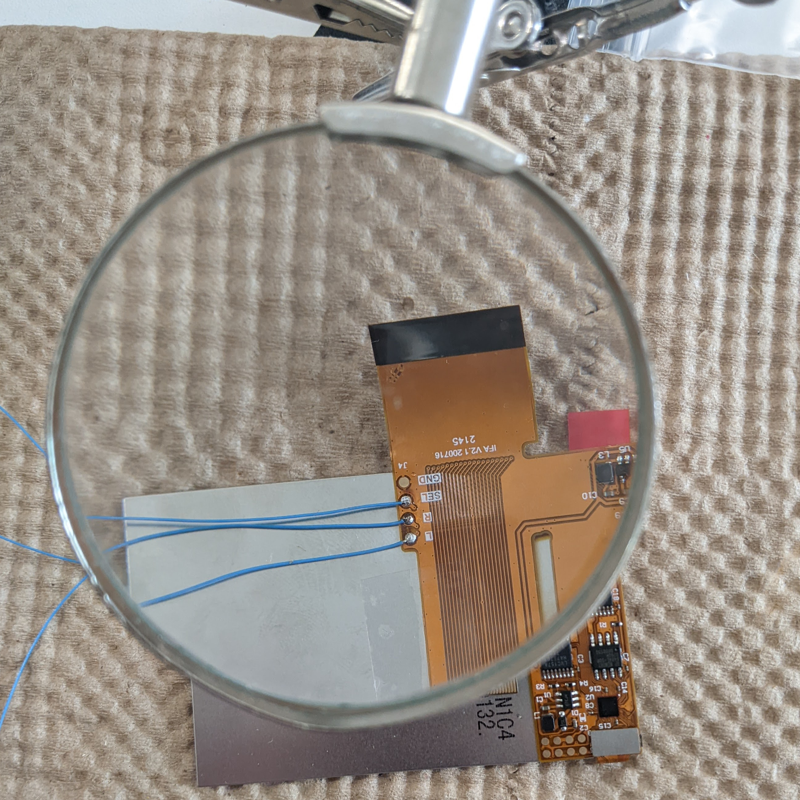
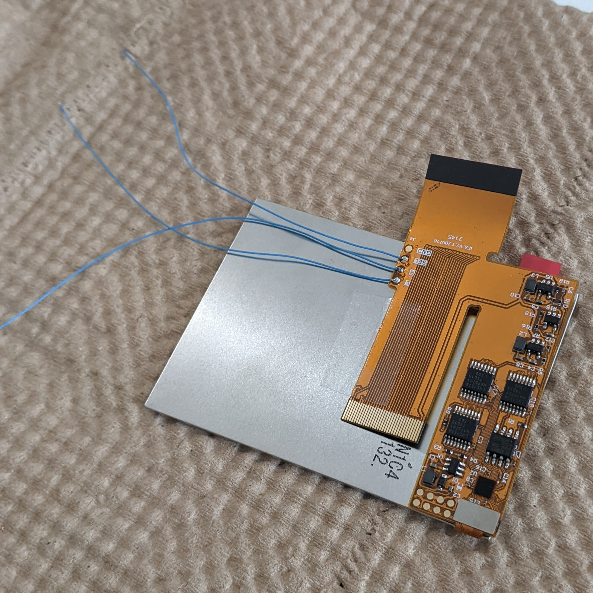

<!--  

    

    
    

    

    
    

 -->

I placed the screen in the case (**be gentle**, you do not want to break the LCD pannel) and **solder** the wires to the motherboard. I used the foam pad that came with the screen. I made a **small inscision** in the foam pad to let the wires through. Do not forget to put the **buttons** and the **silicon pads** as well !

Depending on your motherboard revision, there are **two possible screen connector**. One with **32 pins** and one with **40 pins**. Mine was 40 pins, but if you have the 32 pins variant, just **bend the ribon cable** to expose the correct connector on the top of the screen.

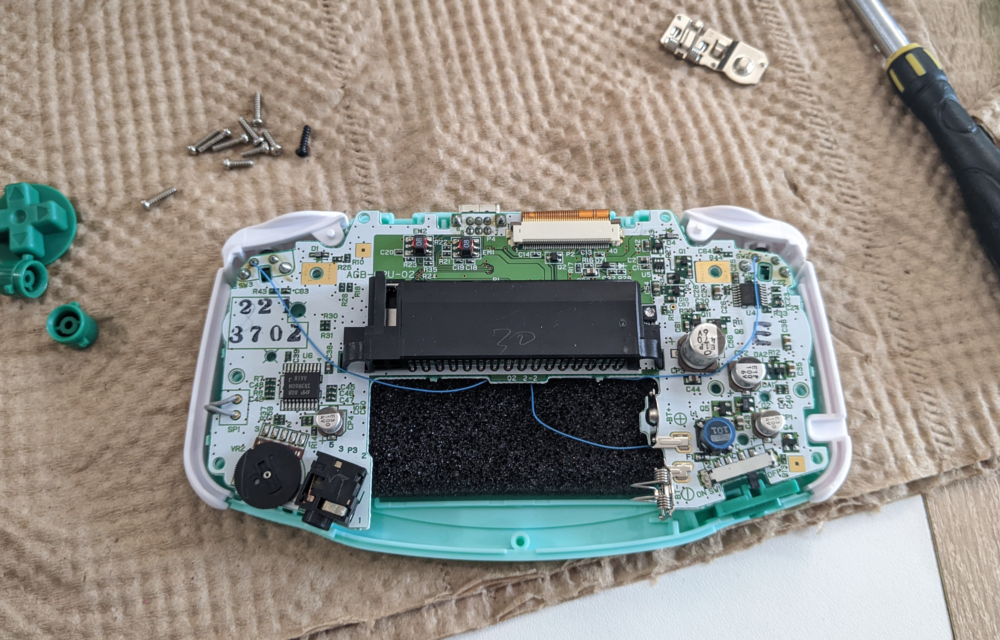

<!-- 

    

    
    
  

 -->

After that, I **secured the motherboard** to the front part of the shell. I then added the **battery cover** and the **sticker** for a more _genuine_ look.

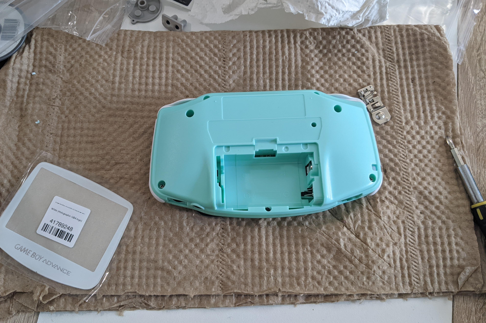
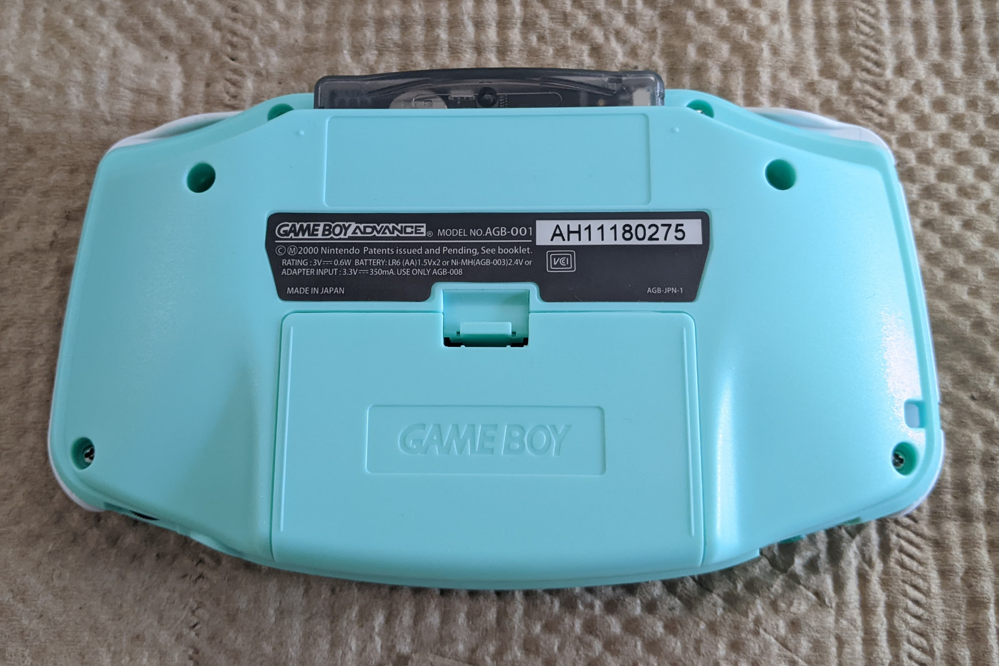
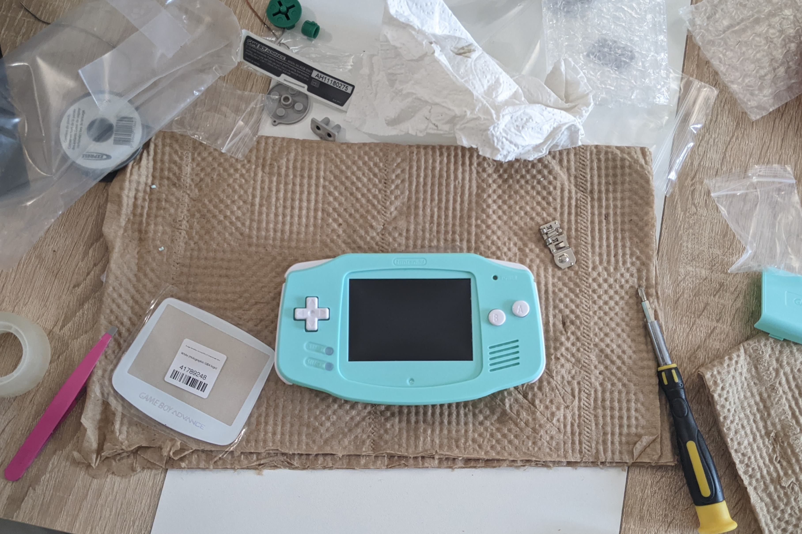

<!-- 

    
    

    
    

    
    

 -->

Before putting the glass lens, I made sure that there were **no dust** on the screen or the screen-facing side of the glass lens, since it would **not be possible** to clean it **later**. I finally removed the glass lens protection film. Here is the final result :

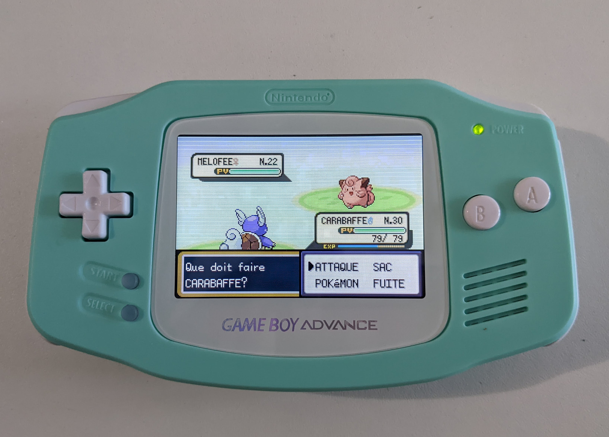

<!-- 

    

    
    

 -->

Now let's beat the **Pokémon league** !